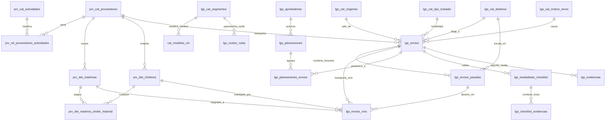

# Módulo: Logística Operativa, Transporte y Envíos (`Lgs_` & `Prv_`)

Total de tablas en este módulo: **17 tablas principales + 3 tablas de soporte/catálogos extendidos**

Este módulo gestiona todo el ciclo de vida del transporte y traslado de unidades terminadas (VINs), desde la parametrización de proveedores y operadores (madrinas y choferes), pasando por el costeo dinámico por matriz origen-destino-segmento-volumen, planeación ejecutiva, multi-destinos (paradas intermedias), inspecciones digitales (checklists de recepción y salida) con evidencias multimedia, y trazabilidad GPS en tiempo real.

---

## 🗺️ Mapa de Relaciones del Módulo

---

## 1. 🚛 Catálogos Maestros de Proveedores y Flota

### 📊 Tabla: `prv_cat_actividades`
Catálogo de actividades comerciales o giros de negocio para clasificar a los proveedores (ej. Trasladistas, Carroceros, Refacciones).

| Campo | Tipo | Nulo | Llave | Defecto | Extra | Descripción |
| :--- | :--- | :---: | :---: | :--- | :--- | :--- |
| **`id_actividad`** | `int` | NO | `PRI` | `NULL` | `auto_increment` | Identificador único de la actividad |
| **`cve_actividad`** | `varchar(30)` | NO | `UNI` | `NULL` | | Clave única (`TRASLADO_UNIDADES`, `CARROCERO`, etc.) |
| **`descripcion`** | `varchar(150)` | NO | | `NULL` | | Descripción detallada de la actividad |
| **`estado`** | `tinyint(1)` | SÍ | | `2` | | 0=Eliminada, 1=Inactiva, 2=Activa |
| **`created_at`** | `timestamp` | SÍ | | `CURRENT_TIMESTAMP` | | Fecha de creación |
| **`updated_at`** | `timestamp` | SÍ | | `CURRENT_TIMESTAMP` | `on update` | Fecha de última modificación |

---

### 📊 Tabla: `prv_rel_proveedores_actividades`
Tabla pivote relacional N:M que asocia un proveedor con una o múltiples actividades registradas en `prv_cat_actividades`.

| Campo | Tipo | Nulo | Llave | Defecto | Extra | Descripción |
| :--- | :--- | :---: | :---: | :--- | :--- | :--- |
| **`id_rel_actividad`** | `bigint` | NO | `PRI` | `NULL` | `auto_increment` | ID primario relacional |
| **`id_proveedor`** | `bigint unsigned` | NO | `MUL` | `NULL` | | FK a `prv_cat_proveedores.id_proveedor` |
| **`id_actividad`** | `int` | NO | `MUL` | `NULL` | | FK a `prv_cat_actividades.id_actividad` |
| **`created_at`** | `timestamp` | SÍ | | `CURRENT_TIMESTAMP` | | Fecha de asignación |

* **Índices:** `UNIQUE KEY uq_prv_actividad (id_proveedor, id_actividad)`

---

### 📊 Tabla: `prv_det_madrinas`
Registro de flota vehicular tipo Nodriza / Madrina perteneciente a los proveedores trasladistas.

| Campo | Tipo | Nulo | Llave | Defecto | Extra | Descripción |
| :--- | :--- | :---: | :---: | :--- | :--- | :--- |
| **`id_madrina`** | `bigint unsigned` | NO | `PRI` | `NULL` | `auto_increment` | ID único de la madrina |
| **`id_proveedor`** | `bigint unsigned` | NO | `MUL` | `NULL` | | FK a `prv_cat_proveedores.id_proveedor` |
| **`numero_economico`**| `varchar(50)` | NO | | `NULL` | | Número económico interno de la unidad |
| **`placas`** | `varchar(30)` | NO | | `NULL` | | Placas del tracto |
| **`placa_caja`** | `varchar(30)` | SÍ | | `NULL` | | Placas de la caja / remolque articulado |
| **`marca`** | `varchar(100)` | SÍ | | `NULL` | | Marca de la madrina |
| **`modelo`** | `varchar(100)` | SÍ | | `NULL` | | Modelo de la madrina |
| **`anio`** | `int` | SÍ | | `NULL` | | Año de fabricación del modelo |
| **`color`** | `varchar(50)` | SÍ | | `NULL` | | Color del tractocamión |
| **`num_serie_vin`** | `varchar(50)` | SÍ | | `NULL` | | Número de Serie / VIN de la madrina |
| **`capacidad_unidades`**|`tinyint unsigned`| NO | | `1` | | Capacidad máxima de carga de autos/VINs |
| **`tipo_madrina`** | `varchar(50)` | SÍ | | `Nodriza` | | Tipo o configuración de la nodriza |
| **`estatus`** | `enum('disponible','en_ruta','mantenimiento','inactiva')` | SÍ | | `disponible` | | Estatus operativo |
| **`estado`** | `tinyint(1)` | SÍ | | `2` | | 0=Eliminado, 1=Inactivo, 2=Activo |
| **`created_at`** | `timestamp` | SÍ | | `CURRENT_TIMESTAMP` | | Fecha de creación |
| **`updated_at`** | `timestamp` | SÍ | | `CURRENT_TIMESTAMP` | `on update` | Fecha de actualización |

---

### 📊 Tabla: `prv_det_choferes`
Padrón de choferes y operadores vinculados a las empresas de traslado.

| Campo | Tipo | Nulo | Llave | Defecto | Extra | Descripción |
| :--- | :--- | :---: | :---: | :--- | :--- | :--- |
| **`id_chofer`** | `bigint unsigned` | NO | `PRI` | `NULL` | `auto_increment` | Identificador único del chofer |
| **`id_proveedor`** | `bigint unsigned` | NO | `MUL` | `NULL` | | FK a `prv_cat_proveedores.id_proveedor` |
| **`nombre`** | `varchar(100)` | NO | | `NULL` | | Nombre(s) del chofer |
| **`apellidos`** | `varchar(100)` | NO | | `NULL` | | Apellidos del chofer |
| **`telefono`** | `varchar(30)` | SÍ | | `NULL` | | Teléfono de contacto móvil |
| **`numero_licencia`** | `varchar(50)` | SÍ | | `NULL` | | Número de licencia de conducir federal/estatal |
| **`vigencia_licencia`**| `date` | SÍ | | `NULL` | | Fecha de expiración de la licencia |
| **`tipo_licencia`** | `varchar(20)` | SÍ | | `NULL` | | Tipo / Categoría (Federal tipo E, B, etc.) |
| **`estatus`** | `enum('disponible','en_ruta','descanso','inactivo')` | SÍ | | `disponible` | | Estatus laboral/operativo |
| **`estado`** | `tinyint(1)` | SÍ | | `2` | | 0=Eliminado, 1=Inactivo, 2=Activo |
| **`created_at`** | `timestamp` | SÍ | | `CURRENT_TIMESTAMP` | | Fecha de alta |
| **`updated_at`** | `timestamp` | SÍ | | `CURRENT_TIMESTAMP` | `on update` | Fecha de actualización |

---

### 📊 Tabla: `prv_det_madrina_chofer_historial`
Historial de asignaciones de choferes a madrinas, garantizando trazabilidad y exactamente 1 conductor activo por unidad en un momento dado.

| Campo | Tipo | Nulo | Llave | Defecto | Extra | Descripción |
| :--- | :--- | :---: | :---: | :--- | :--- | :--- |
| **`id_historial`** | `bigint` | NO | `PRI` | `NULL` | `auto_increment` | ID del registro histórico |
| **`id_madrina`** | `bigint unsigned` | NO | `MUL` | `NULL` | | FK a `prv_det_madrinas.id_madrina` |
| **`id_chofer`** | `bigint unsigned` | NO | `MUL` | `NULL` | | FK a `prv_det_choferes.id_chofer` |
| **`fecha_inicio`** | `datetime` | NO | | `CURRENT_TIMESTAMP` | | Inicio de asignación / turno |
| **`fecha_fin`** | `datetime` | SÍ | | `NULL` | | Fin de asignación / relevo |
| **`activo`** | `tinyint(1)` | SÍ | | `1` | | 1=Conductor asignado actualmente, 0=Histórico |
| **`observaciones`** | `text` | SÍ | | `NULL` | | Notas o motivo del cambio |
| **`created_by`** | `bigint unsigned` | SÍ | | `NULL` | | Usuario que registró la asignación |
| **`updated_by`** | `bigint unsigned` | SÍ | | `NULL` | | Usuario que cerró la asignación |
| **`created_at`** | `timestamp` | SÍ | | `CURRENT_TIMESTAMP` | | Fecha de creación |
| **`updated_at`** | `timestamp` | SÍ | | `CURRENT_TIMESTAMP` | `on update` | Fecha de actualización |

---

## 2. 🗺️ Catálogos de Rutas, Segmentos y Tarifario

### 📊 Tabla: `lgs_cat_tipo_traslado`
Define las modalidades de transporte soportadas por el sistema.

| Campo | Tipo | Nulo | Llave | Defecto | Extra | Descripción |
| :--- | :--- | :---: | :---: | :--- | :--- | :--- |
| **`id_tipo_traslado`** | `tinyint` | NO | `PRI` | `NULL` | `auto_increment` | 1=Madrina, 2=Chofer (Rodando) |
| **`nombre`** | `varchar(100)` | NO | | `NULL` | | Nombre descriptivo |
| **`activo`** | `tinyint(1)` | SÍ | | `1` | | 1=Activo, 0=Inactivo |
| **`created_at`** | `timestamp` | SÍ | | `CURRENT_TIMESTAMP` | | Fecha de creación |

---

### 📊 Tabla: `lgs_cat_motivo_envio`
Motivos comerciales u operativos para el traslado de unidades.

| Campo | Tipo | Nulo | Llave | Defecto | Extra | Descripción |
| :--- | :--- | :---: | :---: | :--- | :--- | :--- |
| **`id_motivo`** | `int` | NO | `PRI` | `NULL` | `auto_increment` | ID del motivo |
| **`cve_motivo`** | `varchar(40)` | NO | `UNI` | `NULL` | | Clave única (`ENTREGA_DIST`, `TRASLADO_CARROCERIA`, etc.) |
| **`descripcion`** | `varchar(150)` | NO | | `NULL` | | Descripción del motivo |
| **`activo`** | `tinyint(1)` | SÍ | | `1` | | 1=Activo, 0=Inactivo |
| **`created_at`** | `timestamp` | SÍ | | `CURRENT_TIMESTAMP` | | Fecha de creación |

---

### 📊 Tabla: `lgs_cat_tipo_destino`
Tipos de destino clasificados para control de entrega (`DISTRIBUIDOR`, `CARROCERO`, `CLIENTE_FINAL`, `ALMACEN`, `PLANTA`, `OTRO`).

| Campo | Tipo | Nulo | Llave | Defecto | Extra | Descripción |
| :--- | :--- | :---: | :---: | :--- | :--- | :--- |
| **`id_tipo_destino`** | `tinyint` | NO | `PRI` | `NULL` | `auto_increment` | ID del tipo de destino |
| **`cve_destino`** | `varchar(40)` | NO | `UNI` | `NULL` | | Clave del destino |
| **`descripcion`** | `varchar(150)` | NO | | `NULL` | | Descripción |
| **`activo`** | `tinyint(1)` | SÍ | | `1` | | 1=Activo, 0=Inactivo |
| **`created_at`** | `timestamp` | SÍ | | `CURRENT_TIMESTAMP` | | Fecha de creación |

---

### 📊 Tabla: `lgs_cat_origenes`
Puntos de origen de despacho (Plantas y almacenes centrales) con coordenadas GPS para la API de rutas.

| Campo | Tipo | Nulo | Llave | Defecto | Extra | Descripción |
| :--- | :--- | :---: | :---: | :--- | :--- | :--- |
| **`id_origen`** | `int` | NO | `PRI` | `NULL` | `auto_increment` | ID de origen |
| **`nombre`** | `varchar(150)` | NO | `UNI` | `NULL` | | Nombre del origen (Planta 1, 2, 3, 4, 5, etc.) |
| **`direccion`** | `varchar(255)` | SÍ | | `NULL` | | Dirección física completa |
| **`lat`** | `decimal(10,7)` | SÍ | | `NULL` | | Latitud GPS |
| **`lng`** | `decimal(10,7)` | SÍ | | `NULL` | | Longitud GPS |
| **`activo`** | `tinyint(1)` | SÍ | | `1` | | 1=Activo, 0=Inactivo |
| **`created_at`** | `timestamp` | SÍ | | `CURRENT_TIMESTAMP` | | Fecha de creación |

---

### 📊 Tabla: `lgs_cat_destinos`
Puntos de destino frecuentes / plazas del tarifario nacional (41 plazas) con coordenadas GPS.

| Campo | Tipo | Nulo | Llave | Defecto | Extra | Descripción |
| :--- | :--- | :---: | :---: | :--- | :--- | :--- |
| **`id_destino`** | `int` | NO | `PRI` | `NULL` | `auto_increment` | ID de destino |
| **`nombre`** | `varchar(150)` | NO | `UNI` | `NULL` | | Nombre de la plaza/destino |
| **`nombre_libre`** | `varchar(255)` | SÍ | | `NULL` | | Alias libre opcional |
| **`id_tipo_destino`** | `tinyint` | SÍ | `MUL` | `NULL` | | FK a `lgs_cat_tipo_destino` |
| **`direccion`** | `varchar(255)` | SÍ | | `NULL` | | Dirección completa |
| **`lat`** | `decimal(10,7)` | SÍ | | `NULL` | | Latitud GPS |
| **`lng`** | `decimal(10,7)` | SÍ | | `NULL` | | Longitud GPS |
| **`activo`** | `tinyint(1)` | SÍ | | `1` | | 1=Activo, 0=Inactivo |
| **`created_at`** | `timestamp` | SÍ | | `CURRENT_TIMESTAMP` | | Fecha de creación |

---

### 📊 Tabla: `lgs_cat_segmentos`
Catálogo maestro de segmentos vehiculares para cotización logística (Ligeros, Medianos, Pesados, Buses, Lowboy).

| Campo | Tipo | Nulo | Llave | Defecto | Extra | Descripción |
| :--- | :--- | :---: | :---: | :--- | :--- | :--- |
| **`id_segmento`** | `int` | NO | `PRI` | `NULL` | `auto_increment` | Identificador único del segmento |
| **`nombre`** | `varchar(100)` | NO | `UNI` | `NULL` | | Nombre (`LIGEROS`, `MEDIANO`, `PESADO`, `BUSES`, `LOWBOY`) |
| **`descripcion`** | `text` | SÍ | | `NULL` | | Detalle de modelos pertenecientes |
| **`activo`** | `tinyint(1)` | SÍ | | `2` | | 0=Eliminado, 1=Inactivo, 2=Activo |
| **`created_at`** | `timestamp` | SÍ | | `CURRENT_TIMESTAMP` | | Fecha de creación |
| **`updated_at`** | `timestamp` | SÍ | | `CURRENT_TIMESTAMP` | `on update` | Fecha de actualización |

---

### 📊 Tabla: `lgs_costos_rutas`
Matriz tarifaria por tipo de traslado, origen, destino, segmento vehicular y rangos de unidades para descuentos por escala.

| Campo | Tipo | Nulo | Llave | Defecto | Extra | Descripción |
| :--- | :--- | :---: | :---: | :--- | :--- | :--- |
| **`id`** | `bigint` | NO | `PRI` | `NULL` | `auto_increment` | ID primario |
| **`id_tipo_traslado`** | `tinyint` | NO | `MUL` | `NULL` | | FK a `lgs_cat_tipo_traslado` |
| **`id_origen`** | `int` | NO | `MUL` | `NULL` | | FK a `lgs_cat_origenes` |
| **`id_destino`** | `int` | NO | `MUL` | `NULL` | | FK a `lgs_cat_destinos` |
| **`id_segmento`** | `int` | NO | `MUL` | `NULL` | | FK a `lgs_cat_segmentos` |
| **`num_vins_min`** | `tinyint` | NO | | `1` | | Límite inferior de unidades para aplicar factor |
| **`num_vins_max`** | `tinyint` | NO | | `99` | | Límite superior de unidades |
| **`km`** | `decimal(10,2)` | NO | | `0.00` | | Kilómetros de distancia calculada |
| **`costo_por_km`** | `decimal(10,4)` | NO | | `0.0000` | | Tarifa unitaria por kilómetro |
| **`precio_plano`** | `decimal(12,2)` | NO | | `0.00` | | Costo fijo (casetas especiales, cruces en ferry, etc.) |
| **`factor`** | `decimal(5,2)` | SÍ | | `1.00` | | Factor de volumen/escala |
| **`activo`** | `tinyint(1)` | SÍ | | `2` | | 0=Eliminado, 1=Inactivo, 2=Activo |
| **`created_at`** | `timestamp` | SÍ | | `CURRENT_TIMESTAMP` | | Fecha de creación |
| **`updated_at`** | `timestamp` | SÍ | | `CURRENT_TIMESTAMP` | `on update` | Fecha de actualización |

* **Índices:** `UNIQUE KEY uq_ruta_traslado_segmento_vins (id_tipo_traslado, id_origen, id_destino, id_segmento, num_vins_min, num_vins_max)`

---

## 3. 📦 Envíos, Itinerario y Asignación de VINs

### 📊 Tabla: `lgs_envios`
Cabecera principal del envío logístico con folio autonumérico protegido por concurrencia (`EN-000001`).

| Campo | Tipo | Nulo | Llave | Defecto | Extra | Descripción |
| :--- | :--- | :---: | :---: | :--- | :--- | :--- |
| **`id_envio`** | `bigint` | NO | `PRI` | `NULL` | `auto_increment` | ID único del envío |
| **`folio`** | `varchar(20)` | NO | `UNI` | `NULL` | | Folio oficial del envío (`EN-XXXXXX`) |
| **`id_tipo_traslado`** | `tinyint` | SÍ | `MUL` | `NULL` | | FK a `lgs_cat_tipo_traslado` |
| **`id_motivo`** | `int` | SÍ | `MUL` | `NULL` | | FK a `lgs_cat_motivo_envio` |
| **`id_proveedor`** | `bigint` | NO | | `NULL` | | FK a `prv_cat_proveedores.id_proveedor` |
| **`id_origen`** | `int` | SÍ | `MUL` | `NULL` | | FK a `lgs_cat_origenes` |
| **`id_destino`** | `bigint` | SÍ | | `NULL` | | FK a `lgs_cat_destinos` o `cli_clientes` |
| **`destino_nombre_libre`**|`varchar(255)`| SÍ | | `NULL` | | Nombre o referencia libre de destino |
| **`km_total`** | `decimal(10,2)` | SÍ | | `0.00` | | Distancia total calculada (vía Google Maps / Matrix) |
| **`costo_total`** | `decimal(12,2)` | SÍ | | `NULL` | | Costo total consolidado calculado |
| **`fecha_tentativa_envio`**| `date` | SÍ | | `NULL` | | Fecha estimada de salida |
| **`fecha_tentativa_llegada`**| `date`| SÍ | | `NULL` | | Fecha estimada de arribo |
| **`fecha_confirmada_recoleccion`**| `date`| SÍ | | `NULL` | | Fecha pactada para recolección en patio |
| **`fecha_salida_real`** | `datetime` | SÍ | | `NULL` | | Fecha y hora real de salida de planta |
| **`fecha_llegada_real`**| `datetime` | SÍ | | `NULL` | | Fecha y hora real de entrega en destino |
| **`observaciones`** | `text` | SÍ | | `NULL` | | Instrucciones especiales o notas de viaje |
| **`id_estado`** | `tinyint` | SÍ | | `1` | | **1**=Creado, **2**=En Revisión, **3**=Aprobado, **4**=Regresado, **5**=Confirmado Recolección, **6**=En Tránsito, **7**=Entregado, **8**=Cancelado |
| **`created_by`** | `bigint unsigned` | SÍ | | `NULL` | | Usuario creador |
| **`updated_by`** | `bigint unsigned` | SÍ | | `NULL` | | Último usuario editor |
| **`created_at`** | `timestamp` | SÍ | | `CURRENT_TIMESTAMP` | | Fecha de creación |
| **`updated_at`** | `timestamp` | SÍ | | `CURRENT_TIMESTAMP` | `on update` | Fecha de actualización |
| **`deleted_at`** | `timestamp` | SÍ | | `NULL` | | Soft delete |

---

### 📊 Tabla: `lgs_envios_paradas`
Itinerario de paradas sucesivas y multi-destinos para envíos consolidados.

| Campo | Tipo | Nulo | Llave | Defecto | Extra | Descripción |
| :--- | :--- | :---: | :---: | :--- | :--- | :--- |
| **`id_parada`** | `bigint` | NO | `PRI` | `NULL` | `auto_increment` | ID de la escala / parada |
| **`id_envio`** | `bigint` | NO | `MUL` | `NULL` | | FK a `lgs_envios.id_envio` (ON DELETE CASCADE) |
| **`orden`** | `tinyint unsigned` | NO | | `1` | | Secuencia numérica de la parada (1, 2, 3...) |
| **`id_destino_cat`** | `bigint` | SÍ | | `NULL` | | FK a `lgs_cat_destinos` o `cli_clientes` |
| **`destino_nombre_libre`**|`varchar(255)`| SÍ | | `NULL` | | Nombre personalizado del punto de parada |
| **`km_tramo`** | `decimal(10,2)` | SÍ | | `0.00` | | Kilómetros calculados para el tramo específico |
| **`observaciones`** | `text` | SÍ | | `NULL` | | Notas operativas del tramo |
| **`created_at`** | `timestamp` | SÍ | | `CURRENT_TIMESTAMP` | | Fecha de registro |

---

### 📊 Tabla: `lgs_envios_vins`
Detalle de unidades vehiculares (VINs) asignadas al viaje, orden de carga en nodriza y control de entrega individual.

| Campo | Tipo | Nulo | Llave | Defecto | Extra | Descripción |
| :--- | :--- | :---: | :---: | :--- | :--- | :--- |
| **`id`** | `bigint` | NO | `PRI` | `NULL` | `auto_increment` | ID primario |
| **`id_envio`** | `bigint` | NO | `MUL` | `NULL` | | FK a `lgs_envios.id_envio` |
| **`id_unidad`** | `bigint` | NO | | `NULL` | | Identificador del vehículo/VIN |
| **`id_destino`** | `int` | SÍ | `MUL` | `NULL` | | Destino final del VIN |
| **`id_parada`** | `bigint` | SÍ | | `NULL` | | FK a `lgs_envios_paradas.id_parada` (parada de desembarque) |
| **`destino_nombre_libre`**|`varchar(255)`| SÍ | | `NULL` | | Nombre o alias del destino |
| **`id_madrina`** | `bigint` | SÍ | | `NULL` | | Madrina asignada |
| **`id_chofer`** | `bigint` | SÍ | | `NULL` | | Chofer asignado |
| **`posicion_acomodo`** | `tinyint unsigned` | SÍ | | `NULL` | | Posición física en madrina (1º en cargar, 2º en cargar...) |
| **`costo_unidad`** | `decimal(12,2)` | SÍ | | `NULL` | | Costo proporcional de traslado del vehículo |
| **`estado_unidad_fisico`**|`varchar(50)`| SÍ | | `EN_PATIO` | `EN_PATIO`, `EN_ENTREGAS`, `EN_RUTA`, `ENTREGADO` |
| **`fecha_entrega_real`**| `datetime` | SÍ | | `NULL` | | Fecha y hora en que se entregó el vehículo |
| **`recibe_nombre`** | `varchar(150)` | SÍ | | `NULL` | | Nombre de la persona que recibió en destino |
| **`id_estado`** | `tinyint` | SÍ | | `1` | | Estado del VIN dentro del viaje |
| **`created_at`** | `timestamp` | SÍ | | `CURRENT_TIMESTAMP` | | Fecha de asignación |

* **Índices:** `UNIQUE KEY uk_envio_vin (id_envio, id_unidad)`

---

## 4. 📋 Planeaciones Ejecutivas y Aprobaciones

### 📊 Tabla: `lgs_planeaciones`
Agrupador de múltiples envíos en una sola planeación ejecutiva para aprobación presupuestal (`EX-000001`).

| Campo | Tipo | Nulo | Llave | Defecto | Extra | Descripción |
| :--- | :--- | :---: | :---: | :--- | :--- | :--- |
| **`id_planeacion`** | `bigint` | NO | `PRI` | `NULL` | `auto_increment` | ID de planeación |
| **`folio`** | `varchar(20)` | NO | `UNI` | `NULL` | | Folio oficial (`EX-XXXXXX`) |
| **`id_estado`** | `tinyint` | SÍ | | `1` | | 1=Pendiente Aprobación, 2=Aprobada, 3=Rechazada |
| **`total_costo`** | `decimal(14,2)` | SÍ | | `0.00` | | Suma acumulada de costo de todos los envíos |
| **`total_vins`** | `int` | SÍ | | `0` | | Total de vehículos agrupados |
| **`total_km`** | `decimal(10,2)` | SÍ | | `0.00` | | Total de kilómetros de la planeación |
| **`observaciones`** | `text` | SÍ | | `NULL` | | Justificación o notas ejecutivas |
| **`aprobado_por`** | `bigint unsigned` | SÍ | | `NULL` | | Usuario aprobador |
| **`fecha_aprobacion`** | `datetime` | SÍ | | `NULL` | | Momento de la aprobación/rechazo |
| **`created_by`** | `bigint unsigned` | SÍ | | `NULL` | | Usuario que armó el paquete |
| **`created_at`** | `timestamp` | SÍ | | `CURRENT_TIMESTAMP` | | Fecha de creación |
| **`updated_at`** | `timestamp` | SÍ | | `CURRENT_TIMESTAMP` | `on update` | Fecha de actualización |

---

### 📊 Tabla: `lgs_planeaciones_envios`
Tabla pivote N:M entre planeaciones ejecutivas y envíos.

| Campo | Tipo | Nulo | Llave | Defecto | Extra | Descripción |
| :--- | :--- | :---: | :---: | :--- | :--- | :--- |
| **`id_rel`** | `bigint` | NO | `PRI` | `NULL` | `auto_increment` | ID relacional |
| **`id_planeacion`** | `bigint` | NO | `MUL` | `NULL` | | FK a `lgs_planeaciones.id_planeacion` |
| **`id_envio`** | `bigint` | NO | `MUL` | `NULL` | | FK a `lgs_envios.id_envio` |
| **`created_at`** | `timestamp` | SÍ | | `CURRENT_TIMESTAMP` | | Fecha de inclusión |

* **Índices:** `UNIQUE KEY uq_plan_envio (id_planeacion, id_envio)`

---

### 📊 Tabla: `lgs_aprobadores`
Padrón de usuarios autorizados con límites de monto para autorizar planeaciones de transporte.

| Campo | Tipo | Nulo | Llave | Defecto | Extra | Descripción |
| :--- | :--- | :---: | :---: | :--- | :--- | :--- |
| **`id_aprobador`** | `int` | NO | `PRI` | `NULL` | `auto_increment` | ID de aprobador |
| **`id_usuario`** | `bigint unsigned` | NO | `UNI` | `NULL` | | FK a `usuarios.idusuario` |
| **`monto_limite`** | `decimal(12,2)` | SÍ | | `NULL` | | Límite máximo de aprobación (NULL = Ilimitado) |
| **`activo`** | `tinyint(1)` | SÍ | | `1` | | 1=Activo, 0=Inactivo |
| **`created_at`** | `timestamp` | SÍ | | `CURRENT_TIMESTAMP` | | Fecha de alta |

---

## 5. 📸 Despacho, Checklists Digitales y Evidencias

### 📊 Tabla: `lgs_trasladistas_checklist`
Inspección física digital realizada durante la entrega y recepción de vehículos.

| Campo | Tipo | Nulo | Llave | Defecto | Extra | Descripción |
| :--- | :--- | :---: | :---: | :--- | :--- | :--- |
| **`id_checklist`** | `bigint` | NO | `PRI` | `NULL` | `auto_increment` | ID del checklist |
| **`id_envio`** | `bigint` | NO | `MUL` | `NULL` | | FK a `lgs_envios.id_envio` |
| **`id_unidad`** | `bigint` | NO | | `NULL` | | ID del vehículo/VIN inspeccionado |
| **`tipo_checklist`** | `enum('entrada_trasladista','salida_planta','entrega_destino')` | NO | | `NULL` | | Momento de la inspección |
| **`vin_escaneado`** | `varchar(50)` | NO | | `NULL` | | VIN confirmado físicamente con escáner |
| **`usuario_registro_id`**|`int` | NO | | `NULL` | | Usuario responsable de la captura |
| **`comentarios`** | `text` | SÍ | | `NULL` | | Hallazgos, rayones o novedades físicas |
| **`created_at`** | `timestamp` | SÍ | | `CURRENT_TIMESTAMP` | | Fecha y hora de captura |

---

### 📊 Tabla: `lgs_checklist_evidencias`
Almacenamiento de fotografías asociadas al checklist de inspección.

| Campo | Tipo | Nulo | Llave | Defecto | Extra | Descripción |
| :--- | :--- | :---: | :---: | :--- | :--- | :--- |
| **`id_evidencia`** | `bigint` | NO | `PRI` | `NULL` | `auto_increment` | ID de la foto |
| **`id_checklist`** | `bigint` | NO | `MUL` | `NULL` | | FK a `lgs_trasladistas_checklist` |
| **`tipo_foto`** | `varchar(50)` | NO | | `NULL` | | Tipo de foto (`frente`, `trasera`, `odometro`, `costado_izq`, etc.) |
| **`ruta_archivo`** | `varchar(255)` | NO | | `NULL` | | Ruta de almacenamiento en disco |
| **`created_at`** | `timestamp` | SÍ | | `CURRENT_TIMESTAMP` | | Fecha de carga |

---

### 📊 Tabla: `lgs_evidencias`
Evidencias fotográficas y de vídeo generales de salida y entrega de envíos.

| Campo | Tipo | Nulo | Llave | Defecto | Extra | Descripción |
| :--- | :--- | :---: | :---: | :--- | :--- | :--- |
| **`id_evidencia`** | `bigint` | NO | `PRI` | `NULL` | `auto_increment` | ID de la evidencia |
| **`id_envio`** | `bigint` | NO | `MUL` | `NULL` | | FK a `lgs_envios.id_envio` |
| **`id_unidad`** | `bigint` | SÍ | | `NULL` | | ID del VIN específico (opcional) |
| **`tipo_evidencia`** | `tinyint` | NO | | `1` | | 1=Salida de Planta/Patio, 2=Llegada y Recepción en Destino |
| **`ruta_archivo`** | `varchar(255)` | NO | | `NULL` | | Ruta en servidor / `Uploads/Logistica/` |
| **`formato`** | `varchar(10)` | SÍ | | `NULL` | | Extensión (`jpg`, `png`, `mp4`, `pdf`) |
| **`observaciones`** | `text` | SÍ | | `NULL` | | Notas adicionales |
| **`created_by`** | `bigint unsigned` | SÍ | | `NULL` | | Usuario que subió el archivo |
| **`created_at`** | `timestamp` | SÍ | | `CURRENT_TIMESTAMP` | | Fecha de subida |

---

### 📊 Tabla: `lgs_unidades_envios`
Tabla auxiliar / staging para el pool de unidades disponibles y asignaciones de origen-destino en el planificador de carga.

| Campo | Tipo | Nulo | Llave | Defecto | Extra | Descripción |
| :--- | :--- | :---: | :---: | :--- | :--- | :--- |
| **`id_unidad`** | `int` | NO | `PRI` | `NULL` | `auto_increment` | ID de unidad |
| **`vin`** | `varchar(50)` | NO | `UNI` | `NULL` | | Número de Identificación Vehicular |
| **`num_serie`** | `varchar(50)` | SÍ | | `NULL` | | Número de serie del chasis |
| **`modelo`** | `varchar(100)` | SÍ | | `NULL` | | Modelo comercial |
| **`origen`** | `varchar(150)` | SÍ | | `NULL` | | Ubicación actual / patio |
| **`destino`** | `varchar(150)` | SÍ | | `NULL` | | Destino comercial asignado |
| **`estatus`** | `varchar(50)` | SÍ | | `disponible` | | `disponible`, `asignado`, `en_transito`, `entregado` |
| **`created_at`** | `datetime` | SÍ | | `CURRENT_TIMESTAMP` | | Fecha de alta |
